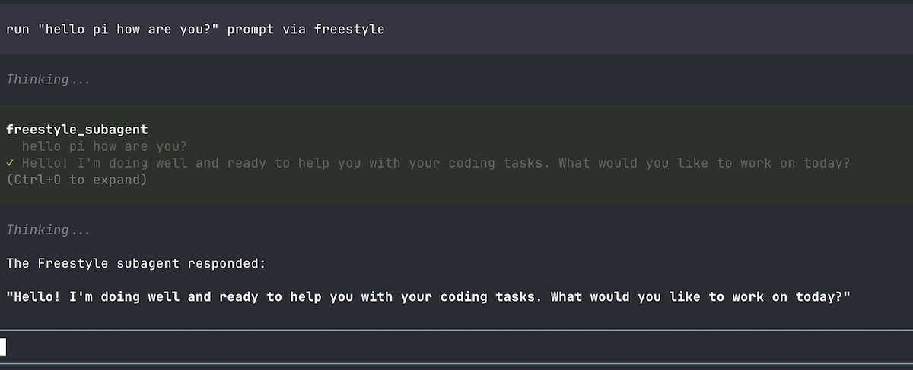

# pi-freestyle-sandbox

[](https://codecov.io/gh/shaftoe/pi-freestyle-sandbox)

A [Pi coding agent](https://pi.dev) extension for running sandboxed subagents in [Freestyle](https://freestyle.sh/) cloud VMs.

## Features

- **Isolated execution**: Run coding tasks in isolated cloud VMs with no access to your local machine
- **Git integration**: Clone repositories directly into VM workspaces
- **Automatic cleanup**: VMs auto-destroy after task completion or idle timeout
- **Full pi experience**: Use all Pi tools and features within the sandboxed environment
- **Context inheritance**: Automatically injects project AGENTS.md into the subagent
- **Cancellable**: Press ESC to abort a running subagent task
- **GitHub CLI auth**: When `GITHUB_TOKEN` is available, `gh` CLI is automatically authenticated and configured as git credential helper for seamless private repo access

> [!NOTE]
> the first time the subagent runs it will take its sweet time to create the Docker-based snapshot, it's going to be reused once is ready by each subsequent tool call so it's a one-time only annoyance.

## Example



## Installation

Requires a valid `FREESTYLE_API_KEY` env var. You can get one for free at <https://dash.freestyle.sh/>

```bash
pi install npm:@alexanderfortin/pi-freestyle-sandbox
```

## Environment Variables

- `FREESTYLE_API_KEY` (required): API key for Freestyle — get one free at <https://dash.freestyle.sh/>. Notice that the lack of it will prevent Pi to load the extension correctly
- `GITHUB_TOKEN` (optional): GitHub token that enables authenticated `gh` CLI commands and git operations on private repos. Set via environment variable or prefix convention (`FREESTYLE_ENV_GITHUB_TOKEN`)
- `FREESTYLE_ENV_*` (optional): Any env var with this prefix is forwarded to the VM (e.g., `FREESTYLE_ENV_NPM_TOKEN` becomes `NPM_TOKEN` inside)

## Management Commands

```
/freestyle list      # List all active VMs
/freestyle cleanup   # Clean up all tracked VMs
```

## Development

```bash
# Install dependencies
bun install

# Run checks
bun run validate

# Run tests
bun run test

# Build
bun run build

# Format code
bun run format
```

## Releasing

This project uses automated publishing to NPM via GitHub Actions. The workflow will:
- Run all CI checks
- Build the package
- Publish to NPM with provenance (signed) via [trusted publishing](https://docs.npmjs.com/trusted-publishers)

## License

See [LICENSE](./LICENSE)
